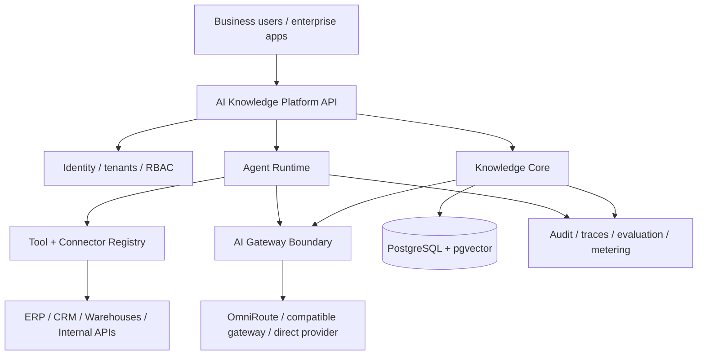

# AI Knowledge Platform

[](https://github.com/guisefe/ai-knowledge-platform/actions/workflows/ci.yml)


An evidence-first AI backend evolving into a reusable enterprise platform for governed AI agents, company knowledge, structured data, and business tools.

The current implementation is deliberately focused on the **Knowledge Core**: turning versioned operational documents into auditable answers. Every answer must identify the supporting passages and document version used. When the available evidence is insufficient, the system must refuse to answer instead of producing an unsupported response.

## Engineering evidence at a glance

This repository is designed to show how an AI system becomes trustworthy enough to integrate with business software—not just how to call a model.

| Engineering concern | Evidence in the current codebase |
| --- | --- |
| **Safe knowledge lifecycle** | Versioned documents, idempotent registration, ownership isolation and soft deletion. |
| **Reliable backend boundaries** | Async FastAPI, SQLAlchemy, Alembic and replaceable storage/LLM provider interfaces. |
| **Security by default** | Argon2 password hashing, signed JWTs and authenticated document operations. |
| **Quality gates** | Ruff, Mypy, unit/contract/PostgreSQL integration tests and GitHub Actions CI. |
| **Honest AI boundary** | Retrieval, citations and abstention are an explicit next milestone; they are not claimed as shipped. |

The engineering question guiding the MVP is: **can the platform return an answer that is traceable to the right document version, or reliably decline when its evidence is insufficient?**

## Enterprise product direction

The longer-term product is not one chatbot or one agent. AI Knowledge Platform is intended to provide the shared infrastructure organizations repeatedly need when deploying AI:

- identity, organizations, tenant isolation, and permissions;
- governed knowledge and retrieval;
- agent and tool authorization;
- connectors to structured data and business systems;
- an external AI Gateway boundary for model routing;
- auditability, evaluation, observability, and usage metering.

Specialized capabilities can then be enabled as modules instead of rebuilding the same infrastructure for every use case.

Potential modules include a cited **Knowledge Agent**, a safe **Data / Text-to-SQL Agent**, and later workflow-specific agents for finance, operations, support, compliance, or analytics.

The model-routing layer is intentionally treated as an external boundary. A deployment may use a direct approved provider, OmniRoute, or another compatible AI gateway without coupling business-domain code to that implementation.

See [Enterprise product vision](docs/product/enterprise-vision.md), [ADR-007: AI gateway boundary](docs/adr/ADR-007-ai-gateway-boundary.md), and the [OmniRoute enterprise integration profile](docs/security/omniroute-enterprise-profile.md).

> Enterprise tenancy, agent runtime, connector catalog, gateway integration, and metering are roadmap capabilities. They are not presented as implemented features until working code and tests exist.

## The first problem we are solving

Operational teams depend on policies, manuals, and procedures that change over time. Finding a plausible answer is not enough: users need to know which source supports it and whether that source is still current.

The Knowledge Core focuses on the backend controls required to make document-based answers traceable, testable, and safe to integrate with other systems.

## Primary MVP use case

An operations analyst asks:

> What is the current procedure for cancelling a contract after an invoice has been issued?

A successful response must contain:

- a concise answer;
- the exact supporting passages;
- the document and version used;
- retrieval metadata;
- a request identifier for tracing.

If the indexed documents do not support a reliable answer, the response status is `insufficient_evidence`.

### Target API contract

```json
{
  "status": "answered",
  "answer": "The cancellation must be reviewed by the billing team before it is approved.",
  "citations": [
    {
      "document_id": "doc_123",
      "document_version": 3,
      "chunk_id": "chunk_184",
      "page": 14,
      "excerpt": "Cancellations requested after invoicing require billing review."
    }
  ],
  "retrieval": {
    "strategy": "vector",
    "top_k": 5
  },
  "request_id": "req_abc"
}
```

The contract above defines the current MVP target. The query endpoint is not implemented yet.

## Knowledge Core guarantees

The RAG MVP is complete only when it can demonstrate that:

- document ingestion is idempotent;
- document updates preserve version history;
- retrieval never crosses an ownership boundary;
- every answer cites stored source passages;
- unsupported questions produce an explicit abstention;
- retrieval quality and latency are measured against a versioned dataset.

## MVP scope

| In the RAG MVP | Enterprise roadmap |
|---|---|
| UTF-8 text and Markdown documents | Additional enterprise connectors and formats |
| Document versioning | Organizations, tenants, and richer RBAC |
| Parsing and deterministic chunking | Agent registry and controlled tool runtime |
| PostgreSQL and pgvector retrieval | Data / Text-to-SQL tools |
| Answers with citations or abstention | AI Gateway integration and model policies |
| Versioned evaluation dataset | Usage metering and enterprise administration |

Keeping these capabilities outside the first RAG milestone is a sequencing decision, not a limitation of the product direction.

## Target enterprise architecture



The current repository implements foundations primarily in the Identity and Knowledge Core paths. The remaining blocks describe the target product architecture.

## Demo datasets

The business scenario uses a fictional organization with versioned operational policies and procedures. It demonstrates document updates, conflicting guidance, stale sources, and questions without sufficient evidence without exposing real company data.

A separate public-domain literature corpus uses Dostoyevsky, Dante, and Plato to evaluate retrieval over long, conceptually dense texts. It is an evaluation corpus, not the business use case.

## Current status

Implemented on `main`:

- FastAPI application foundation;
- liveness endpoint;
- asynchronous SQLAlchemy database foundation;
- Alembic migrations;
- PostgreSQL and pgvector setup;
- versioned document persistence and idempotent version registration;
- registration, OAuth2-compatible login, and authenticated-user resolution;
- Argon2 password hashing and signed JWT access tokens;
- authenticated document creation, listing, retrieval, and soft deletion;
- ownership isolation for document operations;
- streaming `.txt` and `.md` uploads with UTF-8, media-type, and size validation;
- idempotent and concurrency-safe document version creation;
- atomic local storage behind a replaceable storage boundary;
- deterministic mock LLM provider;
- unit, contract, and PostgreSQL integration tests;
- GitHub Actions workflow.

Next engineering milestone:

- deterministic parsing and chunking;
- one evaluated retrieval path;
- answer and abstention contracts.

## Engineering approach

### Measure before expanding

A fluent answer is not evidence that retrieval works. Changes to parsing, chunking, embeddings, ranking, or prompting must be evaluated against the same dataset.

### Keep abstractions at real boundaries

LLM, embedding, storage, gateway, and retrieval implementations may change. Internal factories, interfaces, and layers are not added without a concrete use case.

### Separate enterprise policy from model infrastructure

Tenant permissions, knowledge authorization, agent/tool policy, and business audit records belong to this platform. Provider translation, routing, provider fallback, and provider quota mechanics may be delegated to an AI gateway through a stable boundary.

### Test behavior, not implementation shape

Tests prioritize idempotency, version transitions, ownership isolation, citations, failure recovery, and abstention. Schema assertions are used only when the database contract itself is the behavior under test.

## Technology

- Python 3.12 and FastAPI;
- PostgreSQL with pgvector;
- SQLAlchemy 2.0 async and Alembic;
- Pytest, Ruff, and Mypy;
- Docker Compose and GitHub Actions.

## Run locally

Create the environment file, start PostgreSQL, and install the project:

```bash
cp .env.example .env
docker compose up -d db
python -m pip install -e ".[dev]"
```

Start the API:

```bash
uvicorn app.main:app --host 0.0.0.0 --port 8000 --reload
```

Check the API:

```bash
curl http://localhost:8000/api/v1/health
```

Interactive documentation is available at `http://localhost:8000/docs`.

Alternatively, start both the API and PostgreSQL with Docker Compose:

```bash
docker compose up --build
```

## Quality checks

```bash
python -m ruff check .
python -m ruff format --check .
python -m mypy app
python -m pytest
python -m pip check
```

## Documentation

- [Enterprise product vision](docs/product/enterprise-vision.md)
- [Product brief — current Knowledge Core MVP](docs/product/product-brief.md)
- [Product requirements](docs/product/requirements.md)
- [Success metrics](docs/product/success-metrics.md)
- [OmniRoute enterprise integration profile](docs/security/omniroute-enterprise-profile.md)
- [Architecture decisions](docs/adr)
- [Technical specifications](docs/specs)

## Known limitations

- the end-to-end document-to-answer path is not implemented yet;
- enterprise organization/tenant models are not implemented yet;
- agent runtime and business connectors are not implemented yet;
- AI Gateway integration is not implemented yet;
- authentication has no refresh tokens, password recovery, MFA, or rate limiting yet;
- local document storage is intended for development and single-instance deployments;
- no retrieval benchmark has been published yet.

These limitations are tracked openly so future claims can be supported by working code and measured results.
