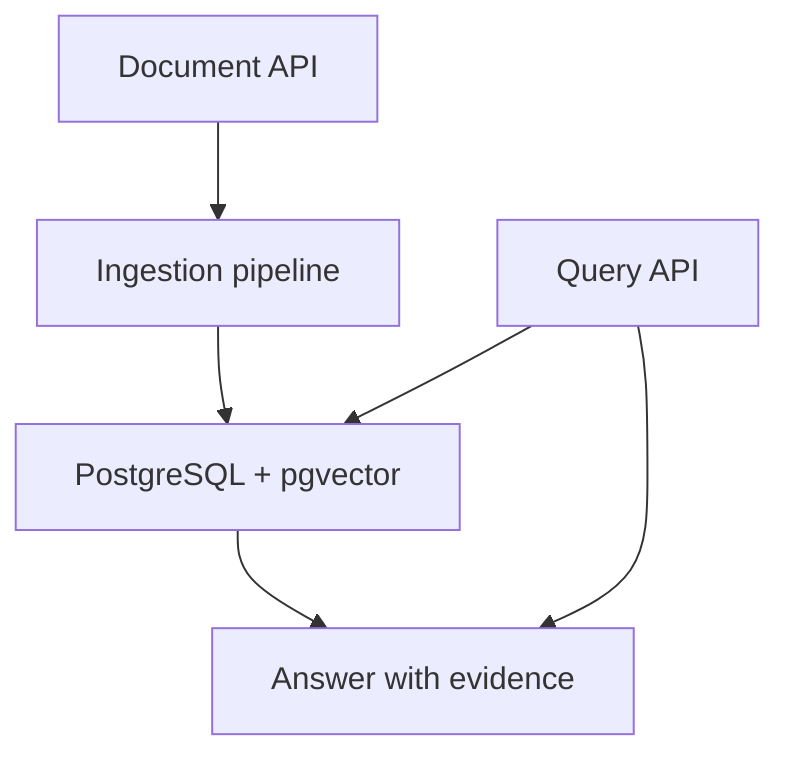

# AI Knowledge Platform

[](https://github.com/guisefe/ai-knowledge-platform/actions/workflows/ci.yml)


An evidence-first backend for turning versioned operational documents into auditable answers.

Every answer must identify the supporting passages and document version used. When the available evidence is insufficient, the system must refuse to answer instead of producing an unsupported response.

## The problem

Operational teams depend on policies, manuals, and procedures that change over time. Finding a plausible answer is not enough: users need to know which source supports it and whether that source is still current.

This project focuses on the backend controls required to make document-based answers traceable, testable, and safe to integrate with other systems.

## Primary use case

An operations analyst asks:

> What is the current procedure for cancelling a contract after an invoice has been issued?

A successful response must contain:

- a concise answer;
- the exact supporting passages;
- the document and version used;
- retrieval metadata;
- a request identifier for tracing.

If the indexed documents do not support a reliable answer, the response status is `insufficient_evidence`.

### Target API contract

```json
{
  "status": "answered",
  "answer": "The cancellation must be reviewed by the billing team before it is approved.",
  "citations": [
    {
      "document_id": "doc_123",
      "document_version": 3,
      "chunk_id": "chunk_184",
      "page": 14,
      "excerpt": "Cancellations requested after invoicing require billing review."
    }
  ],
  "retrieval": {
    "strategy": "vector",
    "top_k": 5
  },
  "request_id": "req_abc"
}
```

The contract above defines the MVP target. The query endpoint is not implemented yet.

## Product guarantees

The MVP is complete only when it can demonstrate that:

- document ingestion is idempotent;
- document updates preserve version history;
- retrieval never crosses an ownership boundary;
- every answer cites stored source passages;
- unsupported questions produce an explicit abstention;
- retrieval quality and latency are measured against a versioned dataset.

## Scope

| In the RAG MVP | Deliberately deferred |
|---|---|
| UTF-8 text and Markdown documents | PDF parsing |
| Document versioning | Text-to-SQL |
| Parsing and deterministic chunking | Autonomous agents |
| PostgreSQL and pgvector retrieval | Multiple vector databases |
| Answers with citations or abstention | Web interface |
| Versioned evaluation dataset | Multiple production LLM providers |

Deferring these capabilities is a scope decision, not a claim that they are unimportant.

## Demo datasets

The business scenario uses a fictional organization with versioned operational policies and procedures. It demonstrates document updates, conflicting guidance, stale sources, and questions without sufficient evidence without exposing real company data.

A separate public-domain literature corpus uses Dostoyevsky, Dante, and Plato to evaluate retrieval over long, conceptually dense texts. It is an evaluation corpus, not the business use case.

## Target architecture



Provider interfaces are introduced only at external boundaries that are expected to change. The domain should not depend directly on a model vendor SDK.

## Current status

Implemented on `main`:

- FastAPI application foundation;
- liveness endpoint;
- asynchronous SQLAlchemy database foundation;
- Alembic migrations;
- PostgreSQL and pgvector setup;
- versioned document persistence and idempotent version registration;
- registration, OAuth2-compatible login, and authenticated-user resolution;
- Argon2 password hashing and signed JWT access tokens;
- deterministic mock LLM provider;
- unit, contract, and PostgreSQL integration tests;
- GitHub Actions workflow.

Under review:

- authenticated document creation, paginated listing, retrieval, and soft deletion;
- ownership isolation that returns the same result for foreign and nonexistent resources.

Next engineering milestone:

- idempotent document content upload and version creation;
- deterministic parsing and chunking;
- one evaluated retrieval path;
- answer and abstention contracts.

## Engineering approach

### Measure before expanding

A fluent answer is not evidence that retrieval works. Changes to parsing, chunking, embeddings, ranking, or prompting must be evaluated against the same dataset.

### Keep abstractions at real boundaries

LLM, embedding, storage, and retrieval implementations may change. Internal factories, interfaces, and layers are not added without a concrete use case.

### Test behavior, not implementation shape

Tests prioritize idempotency, version transitions, ownership isolation, citations, failure recovery, and abstention. Schema assertions are used only when the database contract itself is the behavior under test.

## Technology

- Python 3.12 and FastAPI;
- PostgreSQL with pgvector;
- SQLAlchemy 2.0 async and Alembic;
- Pytest, Ruff, and Mypy;
- Docker Compose and GitHub Actions.

## Run locally

Create the environment file and install the project:

```bash
cp .env.example .env
python -m pip install -e ".[dev]"
```

Start the API:

```bash
uvicorn app.main:app --host 0.0.0.0 --port 8000 --reload
```

Check the API:

```bash
curl http://localhost:8000/api/v1/health
```

Interactive documentation is available at `http://localhost:8000/docs`.

## Quality checks

```bash
python -m ruff check .
python -m ruff format --check .
python -m mypy app
python -m pytest
python -m pip check
```

## Documentation

- [Product brief](docs/product/product-brief.md)
- [Product requirements](docs/product/requirements.md)
- [Success metrics](docs/product/success-metrics.md)
- [Architecture decisions](docs/adr)
- [Technical specifications](docs/specs)

## Known limitations

- the end-to-end document-to-answer path is not implemented yet;
- authentication has no refresh tokens, password recovery, MFA, or rate limiting yet;
- no retrieval benchmark has been published yet.

These limitations are tracked openly so future claims can be supported by working code and measured results.
