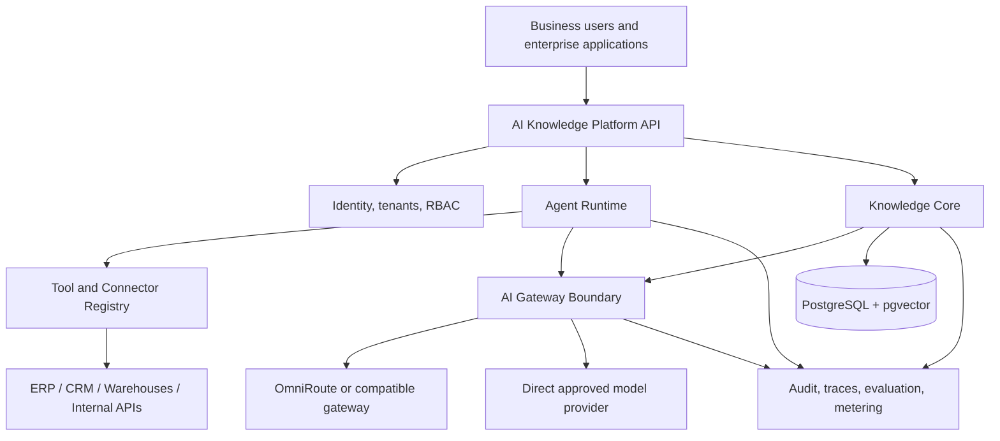

# Enterprise Product Vision

## Product statement

AI Knowledge Platform is an enterprise AI foundation for connecting company knowledge, structured data, and business tools to governed AI agents through one reusable backend.

The product goal is not to ship one chatbot. It is to provide the shared capabilities that organizations repeatedly need when they deploy AI: identity, tenant isolation, permissions, knowledge ingestion, retrieval, controlled model access, tool execution, auditability, evaluation, and operational telemetry.

Specialized agents can then be enabled as modules instead of rebuilding that infrastructure for every use case.

## Product thesis

Enterprise AI projects frequently repeat the same engineering work:

- authentication and authorization;
- document and data access;
- retrieval and context construction;
- model access and routing;
- tool and API integration;
- safety policies and execution controls;
- audit logs and tracing;
- evaluation and usage monitoring.

AI Knowledge Platform centralizes those concerns into a reusable platform layer while keeping model-provider routing behind an external AI Gateway boundary.

The expected business effect is shorter delivery time for new AI use cases, consistent governance across agents, and lower marginal engineering cost as the number of agents grows.

## What plug-and-play means

Plug-and-play does not mean that every enterprise system can be connected with zero integration work.

It means that new capabilities should be added through documented configuration and stable contracts rather than by rebuilding the platform core.

Examples:

- enable a Knowledge Agent against an authorized collection;
- register a SQL tool against an approved data source;
- connect an ERP or CRM through a connector boundary;
- assign an agent to one organization and a defined set of tools;
- change model routing or provider infrastructure without changing business-domain code.

## Target users

### Platform administrator

Configures organizations, users, roles, model policies, connectors, agents, and deployment settings.

### AI/application builder

Creates or configures agents, chooses approved tools and knowledge sources, defines prompts/policies, and evaluates behavior.

### Business user

Uses a specialized agent without needing to understand model providers, vector databases, or orchestration internals.

### Auditor or security reviewer

Inspects who accessed which source, which tools ran, which model configuration was used, and what evidence supported an output.

## Platform capabilities

### 1. Enterprise identity and tenancy

- organizations/tenants;
- memberships and roles;
- tenant-scoped resources;
- service identities/API credentials;
- policy enforcement at resource boundaries.

### 2. Knowledge layer

- versioned document ingestion;
- parsing and deterministic chunking;
- embeddings and retrieval;
- citations and provenance;
- abstention when evidence is insufficient;
- structured knowledge sources over time.

### 3. Agent runtime

- agent registry and versioning;
- approved tool registry;
- controlled tool calling;
- bounded execution loops;
- run state and traceability;
- explicit failure and fallback behavior.

### 4. Connectors and tools

- document repositories;
- databases and warehouses;
- ERP/CRM APIs;
- internal HTTP APIs;
- messaging/workflow systems;
- custom connectors behind a stable contract.

### 5. AI gateway boundary

The platform should not rebuild the entire provider-routing ecosystem inside agent or knowledge-domain code.

A deployable AI Gateway boundary can provide:

- a normalized model API;
- model/provider routing;
- provider translation;
- quotas and rate handling;
- retries, fallback, and circuit breaking;
- model usage and cost telemetry.

OmniRoute is a candidate reference integration for this boundary because it exposes an OpenAI-compatible gateway and already implements provider routing, fallback, quota-aware scheduling, telemetry, MCP/A2A capabilities, and other operational concerns.

OmniRoute is not a mandatory platform dependency. Deployments must remain able to use a direct provider or another compatible gateway through the same platform-owned contract.

### 6. Governance and safety

- RBAC and tenant isolation;
- per-agent tool allowlists;
- data-source permissions;
- model/provider allowlists;
- prompt-injection-resistant tool boundaries;
- auditable executions;
- secret isolation;
- configurable limits and policies.

### 7. Evaluation, observability, and metering

- correlation IDs and traces across platform and gateway calls;
- retrieval and generation latency;
- model and tool outcomes;
- token/model usage where available;
- agent success/failure metrics;
- versioned evaluation datasets;
- cost and usage dimensions suitable for internal chargeback or future billing.

## Initial agent modules

The platform should prove the architecture with a small number of valuable modules rather than a broad catalog.

### Knowledge Agent

Answers questions from authorized operational documents with citations and explicit abstention.

This is the current implementation path and establishes the Knowledge Core.

### Data / Text-to-SQL Agent

Answers questions over approved structured data using schema-aware SQL generation, validation, read-only execution, and traceable results.

A separate Text-to-SQL project can inform this module, but it should be integrated through platform contracts rather than copied directly into the core.

### Future specialized agents

Potential verticals include finance, operations, support, compliance, and analytics. They should be created only after a real customer workflow justifies them.

## Target enterprise shape

## Commercial forms

The same core should be capable of supporting multiple delivery models over time:

- managed B2B SaaS;
- white-label platform for consultancies or software providers;
- dedicated enterprise deployment;
- self-hosted deployment for customers with stricter data requirements.

These are product directions, not current deployment guarantees.

## Current product stage

The project is currently building the first platform capability: the Knowledge Core.

Implemented foundations already include FastAPI, PostgreSQL/pgvector, authentication, versioned documents, tenant-like ownership isolation at the user boundary, storage abstraction, provider boundaries, tests, and CI.

The next goal remains an evaluated end-to-end RAG path with citations and abstention. Enterprise tenancy, agent runtime, connectors, gateway integration, and metering are roadmap capabilities and must not be presented as implemented until working code and tests exist.

## Product principle

Build one trustworthy reusable path first, then generalize only at proven boundaries.

The platform should become broader because multiple real use cases need the same capability, not because an abstract architecture diagram can contain it.
